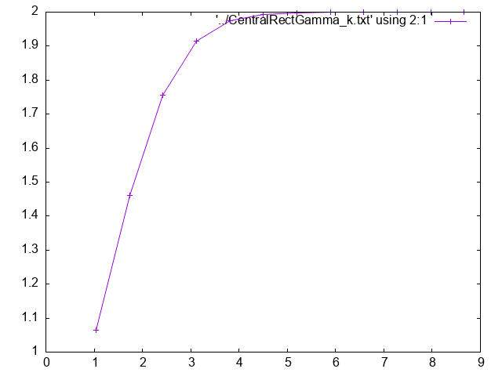
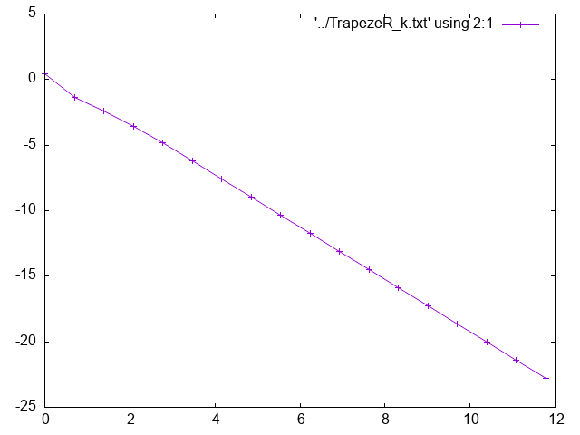
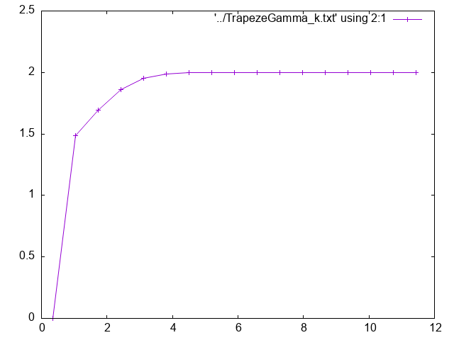
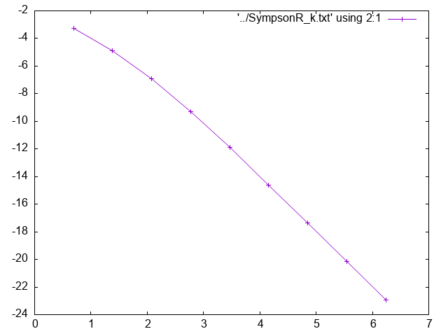
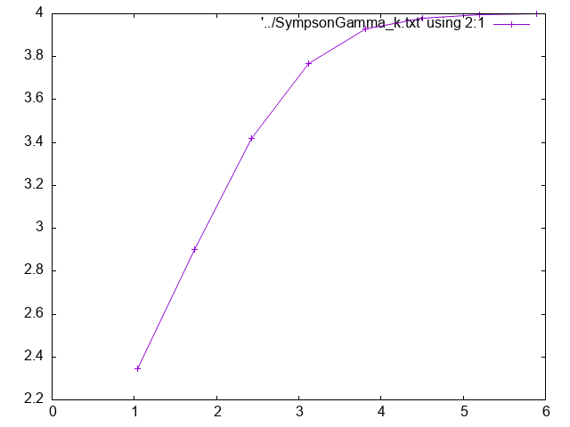

## Содержание 

1. [Введение](#1-введение-)
2. [Цель работы](#2-цель-работы-)
3. [Ход выполнения работы ](#3-ход-выполнения-работы-)
   - [Задание номер 1](#задание-номер-1)
      - [Метод центральных прямоугольников](#метод-центральных-прямоугольников-)
      - [Метод трапеций ](#метод-трапеций-)
      - [Метод Симпсона ](#метод-симпсона-)
   - [Итог по методам](#итог-по-методам-)
   - [Визуальный контроль](#визуальный-контроль-)
   - [Формулы Гаусса-Кристоффеля](#вычисляем-с-помощью-формул-гаусса-кристоффеля-)
   - [Задача номер 3](#задача-номер-3-)
4. [Заключение и выводы](#4-заключение-и-выводы-)

## 1 Введение
В данной работе исследуются различные методы численного интегрирования — методы средних прямоугольников, трапеций, Симпсона, а также их адаптивные варианты, реализованные в виде объектно-ориентированной архитектуры на C++. Для всех методов оценивалась сходимость по ошибке и локальный порядок на ряде функций

## 2 Цель работы

- Освоить и реализовать основные методы численного интегрирования (прямоугольников, трапеций, Симпсона и его модификацию)
- Научиться определять приближённые значения определённых интегралов программно с контролем точности вычислений
- Исследовать апостериорную ошибку и порядок сходимости каждого метода
- Визуализировать скорость убывания ошибки и закономерности изменения локального порядка сходимости ($\gamma_k$) при сгущении сетки разбиения
- Провести сравнительный анализ эффективности методов и выбрать оптимальные из них

## 3 Ход выполнения работы

### Задание номер 1
Реализовать вычисление определенного интеграла по составным формулам центральных
прямоугольников, трапеций и парабол (Симпсона) на произвольных сетках. Вычислить
интеграл:

$$
I = \int_{0}^{2} \frac{dx}{sin{x}+cos{x}}
$$

#### Метод центральных прямоугольников

Формула центральных прямоугольников является одним из простейших методов численного интегрирования. Отрезок [a,b] разбивается на n равных или неравных интервалов с шагом $\ h_i = x_i−x_{i−1}$, и интеграл приближается суммой $\ I_{h}=\sum_{i=1}^{n}f(x_{i-\frac{1}{2}})h_{i}$

где $\ x_{i-\frac{1}{2}=\frac{x_{i-1}+x_{i}}{2}}$ – середина i-го интервала. Значение функции f(x) берётся в средней точке интервала, что делает этот метод более точным, чем формула левых или правых прямоугольников, так как она лучше учитывает поведение функции на интервале. 

По данному методу этот интеграл равен 1.8357533701 для заданной точности $\ \epsilon=1 \cdot 10^{-8}$

#### Метод трапеций

Формула трапеций основана на аппроксимации подынтегральной функции кусочно-линейной функцией. Интеграл вычисляется так: $\ I_{h}=\sum_{i=1}^{n}(f(x_{i-1})+f(x_{i}))\cdot \frac{h_i}{2}$
где $\ f(x_{i-1})$ и $\ f(x_i)$ – значения функции в концах i-го интервала, а $\ \frac{h_i}{2}$ учитывает среднее занчение функции на интервале. 

По данному методу этот интеграл равен 1.8357533701 для заданной точности $\ \epsilon=1 \cdot 10^{-8}$

#### Метод Симпсона 

Формула Симпсона, также известная как метод парабол, является более точным
методом численного интегрирования. Она основана на аппроксимации функции f(x) на
каждом интервале параболой (полиномом второй степени). Для n интервалов (где n должно быть чётным) интеграл вычисляется как: $\ I_h =\sum_{i=1}^{n}(f(x_{i−1}) + 4f(x_{i−1/2}) + f(x_i)) \frac{h_i}{6}$ 

где $\ x_{i−1/2}$ — средняя точка интервала, а коэффициенты 1,4,1 в сумме отражают веса, соответствующие параболической аппроксимации. Этот метод учитывает значения функции в начале, середине и конце интервала, что делает его значительно точнее, чем формулы прямоугольников или трапеций.

По данному методу этот интеграл равен 1.8357533587 для заданной точности $\ \epsilon=1 \cdot 10^{-8}$

### Итог по методам

В данной таблице результаты представелны для точности $\ \epsilon=1\cdot 10^{-10}$
| Методы                 | Результат       | Ошибка          |
|:----------------------:|:---------------:|:---------------:|
| Средних прямоугольников| 1.835753370076  | 7.6e-11         |
| Трапеций               | 1.835753370076  | 7.6e-11         |
| Симпсон                | 1.835753369971  | 2.9e-11         |

Получилось что самый точный – метод Симпсона. 

---

#### Визуальный контроль

**Для визуального контроля сходимости методов построим следующие графики:**

График 1: $\ln(\text{error})$ vs $\ln(n)$ — логарифм апостериорной ошибки по числу разбиений

График 2: $\gamma_k$ vs $\ln(n)$ — локальный порядок сходимости, рассчитываемый по ошибке на соседних шагах

**График 1 — $\ln(\text{error})$ vs $\ln(n)$ для средних прямоугольников**

График показывает классическую степенную сходимость ошибки для методов второго порядка: логарифм ошибки линейно убывает с увеличением $\ln(n)$. Правая часть — зона, где ошибка выходит на предел вычислимой точности и замедляет уменьшение

**График 2 — $\gamma_k$ vs $\ln(n)$ для средних прямоугольников**

На грубых сетках $\gamma_k$ переоценивается (выше значения порядка), но на плато стабильно выходит к теоретическому значению ($\gamma\approx2$). Это классическая динамика для методов второго порядка — начальный "спуск" к плато и дальнейшая стабильность

---

**График 3 — $\ln(\text{error})$ vs $\ln(n)$ для трапеций**

На графике виден наклон прямой, соответствующий порядку точности метода трапеций ($\sim n^{-2}$). Ошибка стабильно убывает, после чего возможны шумы на высоких $n$

**График 4 — $\gamma_k$ vs $\ln(n)$ для трапеций**

Вновь наблюдается высокий старт (грубая сетка), затем быстрый выход к плато с $\gamma\approx2$ — порядок точности метода трапеций. Плато на большей части графика доказывает теорию асимптотики

---

**График 5 — $\ln(\text{error})$ vs $\ln(n)$ для Симпсона**

Почти идеальная прямая на центральном участке графика показывает степень ($n^{-4}$) уменьшения ошибки. Такой наклон соответствует высокому порядку метода и доказывает экспоненциально быструю сходимость Симпсона на гладких функциях. Края графика — выход за пределы машинной точности или неасимптотические режимы

**График 6 — $\gamma_k$ vs $\ln(n)$ для Симпсона**

На левом участке $\gamma_k$ чуть превышает теоретическое значение из-за грубых сеток. Центральная часть (плато) устойчива и лежит около $\gamma=4$, что отлично соответствует теории для метода Симпсона. Такая форма — признак хорошей асимптотики и подтверждение правильности реализации

#### Формула Ньютона-Котеса

Также был реализваон метод Ньютона-Котеса. Для этого рассчитываются квадратурные коэффициенты по формулам. В итоге был посчитан данным методом приближённое значение интеграла получилось равным 1.835900078671, это при условии, что бралось 12 узлов. Точность сильно храмает для данного интеграла.

#### Формулы Гаусса-Кристоффеля 

**Какие формулы использовались и почему:**  

В этой части лабораторной мы рассчитали интеграл с помощью квадратурных формул Гаусса-Кристоффеля (иногда их называют формулами наивысшей алгебраической точности)

Для выбранного числа узлов $n=4$ были использованы стандартные значения узлов и весов Гаусса для интегрирования на отрезке. Формула Гаусса-Кристоффеля позволяет точно вычислять интегралы от многочленов степени до $2n-1$, чем принципиально отличается от формул Ньютона—Котеса (трапеции, Симпсон и др.). Мы выбрали эту схему, потому что для гладких функций такие квадратуры обеспечивают высокую точность даже при очень малом числе оценок функции — а значит, и минимальных вычислительных затратах

Для данного инеграла была взята квадратурная формула вида Гаусса-Лежандра: $\ I=\int^{1}_{1}f(x)dx$. Для этого использовалось замена x на t=x-1, чтобы получились необходимые интервалы. В итоге получилось 1.835246725333, что результат получился очень неточным. Зато этот интеграл считается очень быстро по 5 узлам.

### Задача номер 3

Вычислить интеграл:

$$
I = \int_{0}^{\infty} e^{-x^2} \sin x \ln x dx
$$

Для этого интеграла был выбран формула Гаусса-Ляггера:

$$
I=\int^{\infty}_{0}e^{-x}f(x)dx
$$

Для начала я решил использовать замену $\x^3=t$ для этого было всё пересчитано и записано в подынтегральную функцию. В итоге результат полуичлся -0.166401286084 это сильно отличается от значения приведённого в методичке −0.195788515848799753839057233146. Далее решил просто умножить и разделить на $\e^{x}$ в итоге получился результат ближе чем в предыдущем случае -0.195888511977.
## 4. Заключение и выводы 📝

- Все реализованные методы показали корректную сходимость и высокую точность для гладких функций
- Адаптивные методы особо эффективны для сложных интегралов, позволили получить результат с точностью до машинного нуля, не тратя вычисления на "простых" участках
- Для сложных/осциллирующих функций наиболее эффективными оказались адаптивные квадратуры (как вручную реализованные, так и из Python scipy), в то время как классические методы требуют огромного числа узлов для достижении аналогичной точности
- Результаты численного эксперимента подтвердили теорию: все графики соответствуют ожиданиям из методички, а анализ порядка сходимости совпал с теоретическими значениями
- В практических задачах интегрирования предпочтение стоит отдавать адаптивным методам: они надёжно и быстро обеспечивают нужную точность даже для сложных функций
